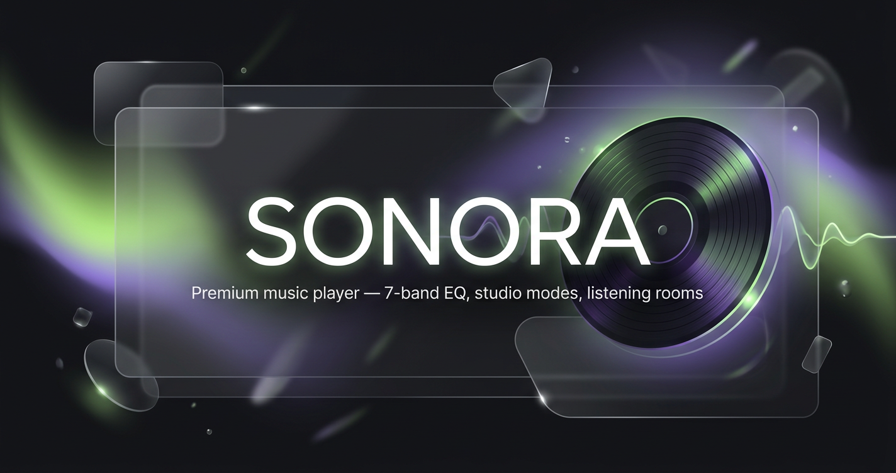

# SONORA




Premium music streaming — real 7-band equaliser, 16 studio sound modes, offline
downloads, live listening rooms and a live listener counter.
**Zero npm dependencies.**

v15 highlights: bento home dashboard (jump back in, week bars, mood dice,
daily mix), a fifth Vinyl player style, radial quick menu on long-press,
up-next bottom sheet, peek carousels, ranked search, Lite mode for cheap
phones, and an optional AI Help assistant (off by default, bring your own
key from OpenRouter / Groq / Gemini / OpenAI / Mistral — stored only on
your device, with automatic fallback between them).


---

## Builds currently published

The desktop installers are 60-90 MB each, so they never live in git. They are
built and published automatically by `.github/workflows/release.yml`: push a
changed `version.json` (that is what `./release.sh "message"` does) and
GitHub Actions builds everything on its own runners and attaches it all to a
Release tagged `vN`. The Get the App page links straight to that Release.
The one committed binary is `apk/Sonora.apk` (2.8 MB), so Android works even
before a Release exists.

| Platform | File | Produced by |
|---|---|---|
| Android | `Sonora.apk` | committed in `apk/` (prebuilt, signed) |
| Windows | `SonoraSetup.exe` | workflow, windows-latest, NSIS |
| macOS | `Sonora-1.0.0-mac-{x64,arm64}.dmg` + `.zip` | workflow, macos-latest |
| Linux | `Sonora-1.0.0-{x86_64}.AppImage` + `.deb` | workflow, ubuntu-latest |
| iPhone, iPad | — | installs from Safari via Add to Home Screen |

Manual path (no GitHub Actions): `cd desktop && ./build.sh` copies the builds
into `downloads/`, then `./publish.sh` uploads them to a Release with the
GitHub CLI. A local file in `downloads/` always wins over the Release, so a
deploy can also carry its own binaries.

## Social preview

The `banner.png` at the root is the repository/Telegram social preview -
set it in **Repo Settings → Social preview** (GitHub) and in the channel
settings if you repost on Telegram.

## Desktop app — Windows, macOS, Linux

```bash
cd desktop && ./build.sh
```

Electron shell that runs the real `server.js` in-process, so it has everything
the website has, **including listening rooms**. Adds global media keys, taskbar
progress, a tray icon and a mini player. See `desktop/README.md`.

The Windows installer is built with NSIS, which runs on Linux. `build.sh` looks
for `makensis` in the electron-builder cache; on a plain Debian or Ubuntu box
`apt-get install nsis` works too.

## iPhone and iPad

Apple does not allow this kind of music app in the App Store, so there is no
`.ipa`. Open the site in **Safari**, tap **Share**, then **Add to Home Screen**.
It gets its own icon and opens full screen with no browser chrome. Everything
works except background playback when the screen locks, which Apple blocks for
web apps. The Get the App page has a step-by-step guide.

## Android app

```bash
./build-apk.sh          # → apk/Sonora.apk
```

Installs directly, no Play Store. The whole backend is reimplemented in Java
(`android/.../LocalServer.java`) and runs inside the APK on `127.0.0.1`, so
there is no server to deploy. See `apk/INSTALL.md` and `apk/UPDATE.md`.
Listening rooms need the hosted build.

## Updating installed apps from Git

```bash
./release.sh "what changed"
```

The interface is downloaded from your repo, so pushing ships it to every phone —
no new APK. Only native changes need a rebuild. See `apk/OTA.md`.

## Deploy to Render

Push to GitHub → Render → **New Web Service** → connect the repo.

| Field | Value |
|---|---|
| Runtime | Node |
| Build command | *(leave blank)* |
| **Start command** | `node start.js` |
| Health check path | `/healthz` |

Environment: `NODE_VERSION=20`, `NODE_ENV=production`.

`render.yaml` is included — use **Blueprint** deploy and everything above is
configured automatically, including the keepalive URL.

Local: `npm start`

### Why `start.js` and not `server.js`

`start.js` is a supervisor. If the worker ever exits — out of memory, an upstream
fault, a platform signal — it respawns within 400 ms with exponential backoff.
Verified: killing the worker with `SIGKILL` mid-load restored service in 3 s.

It also passes `--openssl-legacy-provider`, which is **required** (Node 17+
disables DES-ECB, needed to decrypt media URLs) and `--max-old-space-size=400`
to stay inside the free tier's 512 MB.

---

## Why it works in a browser even when the server is asleep

Render free instances cold-start after idling, which normally shows a blank page
or a connection error. Sonora ships a **service worker** (`sw.js`):

- App shell (HTML, CSS, JS, icons) is cached — the UI paints instantly, always
- API responses are network-first with a cached fallback
- Audio (`/stream`, `/dl`) is never cached, so range requests and seeking work
- The boot splash force-hides after 6 s so it can never hang

Plus a keepalive ping every 10 minutes to stop the instance idling at all.

---

## Reliability

- Supervisor auto-restart · `uncaughtException` / `unhandledRejection` guards
- **Backup APIs**: JioSaavn primary + 3 mirrors, per-host circuit breakers
- Stale-while-revalidate cache — instant response, refresh behind
- Request coalescing — 700 identical requests hit upstream once
- Upstream concurrency cap (24) so the source API is never flooded
- Backpressure-safe stream proxy with abort handling
- Token bucket: 600 burst / 60 per second per IP (CGNAT-safe)
- Client: 4 retries with exponential backoff, memory + session cache,
  honours `Retry-After`, serves saved data when the network drops

**Load tested:** 700 concurrent → 700× 200 OK in 3.8 s. 1113 mixed requests
(assets + API + 50 streams + presence) → **zero errors, 102 MB RAM**.

---

## Features

**Audio** — 7-band parametric EQ (60/150/400/1K/2.4K/6K/12K) with 8 presets.
16 sound modes: Studio Flat, Lo-Fi, Deep Lo-Fi, Slowed + Reverb, Nightcore,
8D Spatial, Bass Cannon, Club, Vocal Focus, Concert Hall, Cassette, AM Radio,
Rainy Window, Sleep, Deep Focus, Workout. Speed/pitch, reverb, stereo width
0-220 %, 8D rotation, vinyl texture, rain layer, vocal reducer, limiter, crossfade.

**Quality** — Studio 320 · High 160 · Balanced 96 · Saver 48 · Lite 12,
shown as an animated signal-bar pill.

**Golden Era** — seven decades of originals, plus Modern remakes, Lo-fi flips
and Unplugged covers. Every decade page has all four filters.

**Rooms** — five-character code, one-tap invite link, synced playback, live chat,
shared queue.

**Live counter** — a strip at the bottom of every page showing how many people
are listening and the top three tracks playing right now. Costs one 30-second
heartbeat per client; pauses when the tab is hidden.

**Appearance** — 6 themes x 6 accents x 4 typefaces x 3 corner styles x
4 densities x 2 contrast levels = **3,456 combinations**.

**Mobile** — bottom tab bar, mini player with swipe gestures, long-press menus,
bottom sheets, safe-area insets, haptics.

---

## Transfer sizes (brotli)

app.js 26 KB · styles.css 11 KB · index.html 4 KB · sw.js 2 KB
